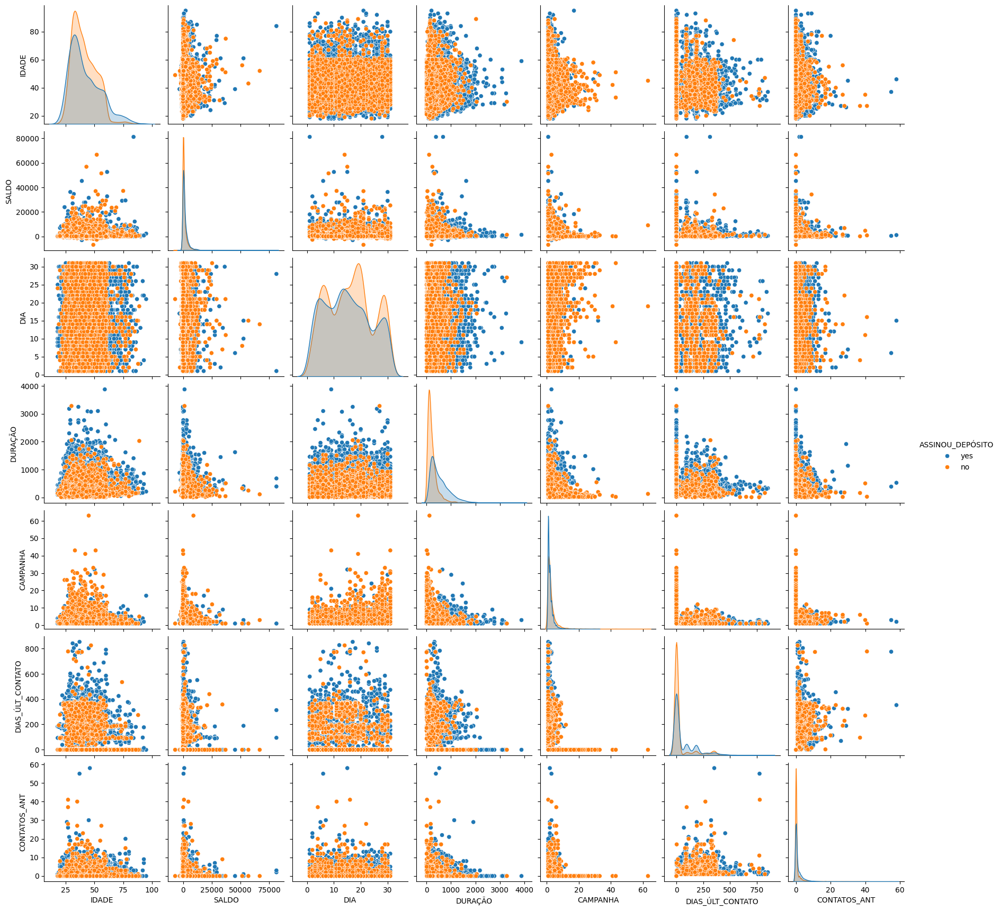

 

# Projeto de Machine Learning

## Descrição do Projeto

Este projeto refere-se a uma campanha de marketing realizada por uma instituição bancária, com o objetivo de promover a assinatura de produtos financeiros a prazo.

A análise proposta contempla a aplicação de técnicas de pré-processamento e modelos de Aprendizado de Máquina, visando avaliar e comparar o desempenho dos algoritmos na previsão da adesão dos clientes a esses produtos.

As etapas do projeto envolveram o entendimento do negócio, o pré-processamento dos dados, o desenvolvimento dos modelos e a apresentação das análises conclusivas.

---

## Objetivo

Avaliar e comparar o desempenho de algoritmos de classificação na previsão da adesão dos clientes aos produtos financeiros a prazo da instituição bancária.

---

## Dataset

O conjunto de dados utilizado foi o Bank Marketing Dataset.

### Fonte dos Dados

[Bank Marketing Dataset](https://www.kaggle.com/datasets/janiobachmann/bank-marketing-dataset)

---

## Tecnologias e Bibliotecas 

- Python
- Pandas
- NumPy
- Matplotlib
- Seaborn
- Scikit-learn
- Jupyter Notebook

---

## Etapas do Projeto

- Entendimento do Negócio
- Pré-Processamento
- Desenvolvimento dos Modelos
- Conclusão 

---

## Estrutura do Projeto

```text
PROJETO-01/
│
├── .vscode/
├── data/
│   └── bank.csv
├── images/
│   └── pairplot.png
├── ProjetoML.ipynb
├── README.md
├── requirements.txt
└── .gitignore
```

---

## Como Executar o Projeto

### Clone o repositório

```bash
git clone URL_DO_REPOSITORIO
```

### Instale as dependências

```bash
pip install -r requirements.txt
```

### Execute o notebook

Abra o arquivo `.ipynb` no Jupyter Notebook ou VS Code.

---

## Resultados

O projeto aplicou técnicas de aprendizado supervisionado para prever a adesão de clientes a produtos financeiros oferecidos por uma instituição bancária.

Inicialmente, foi desenvolvido um modelo de Regressão Logística, avaliado por métricas como Accuracy, Precision, Recall e F1-Score, alcançando aproximadamente 67% de acurácia.

Posteriormente, implementou-se o modelo Random Forest Classifier com otimização de hiperparâmetros utilizando Grid Search e validação cruzada. O modelo apresentou desempenho superior, alcançando aproximadamente 74% de acurácia e melhor capacidade de generalização.

Os resultados demonstram o potencial das técnicas de Machine Learning no apoio à tomada de decisão e ao direcionamento de estratégias de marketing mais assertivas na instituição bancária.

---

## Autora

Luana dos Santos Rocha 